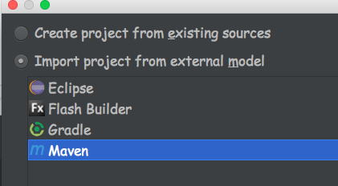
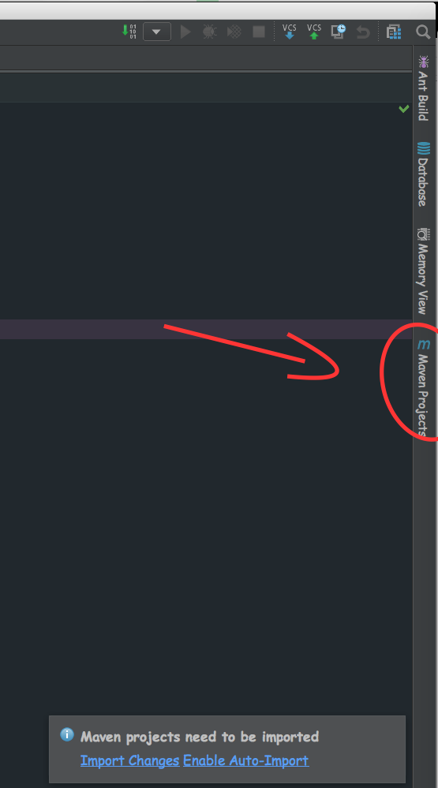
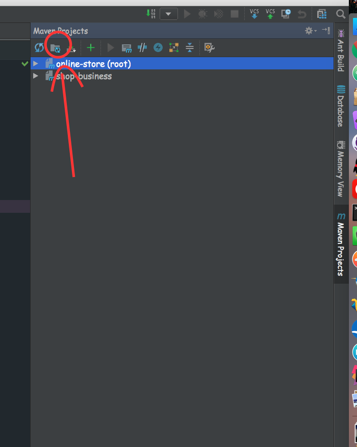
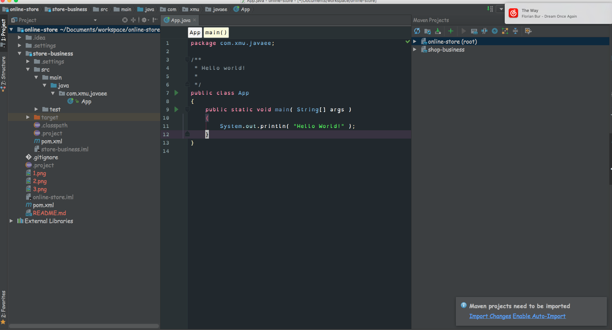
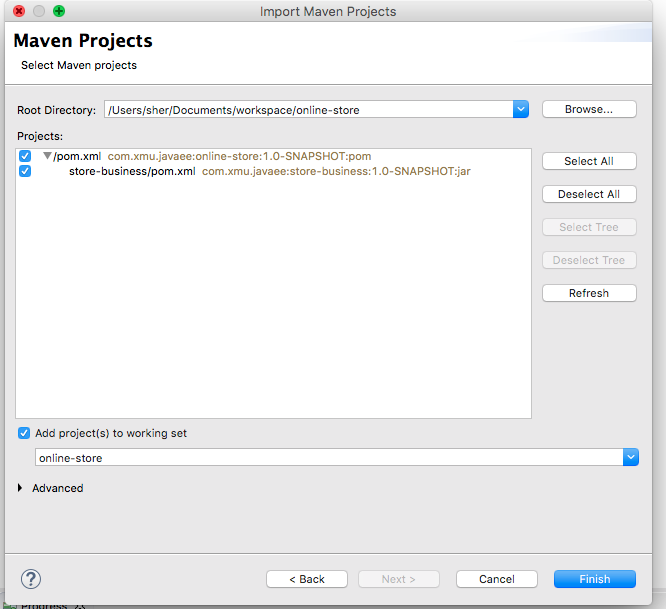
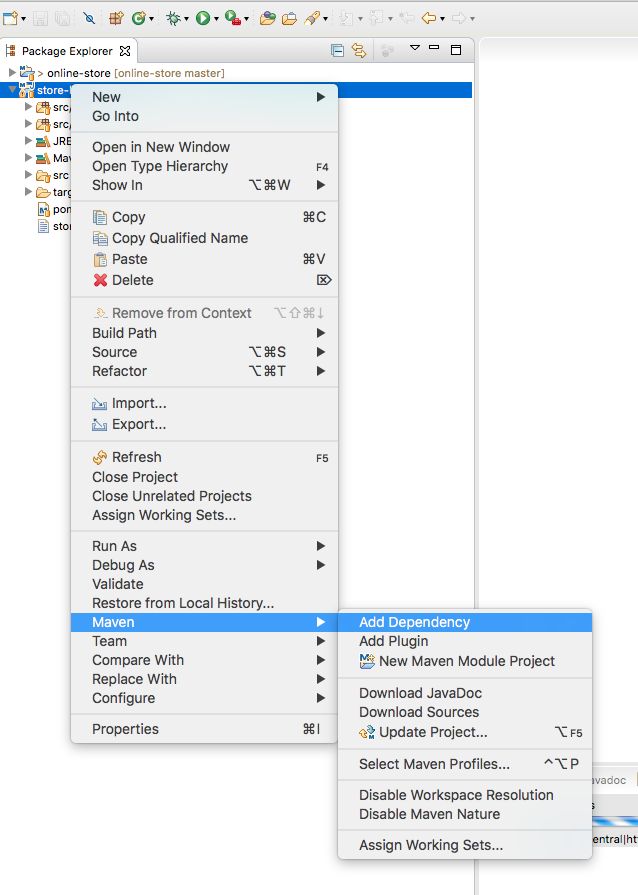

#setup maven

##install
* check the official [site](https://maven.apache.org/install.html)
	* download the package, put it the place you like, extract it
	* add the **the dir contain mvn** to $PATH
	* make sure **JAVA_HOME** is in environment variable
	* run **mvn -version** you should see this
		
		```
		Apache Maven 3.3.9 (bb52d8502b132ec0a5a3f4c09453c07478323dc5; 2015-11-11T00:41:47+08:00)
		Maven home: /Users/sher/marven/apache-maven-3.3.9
		Java version: 1.8.0_121, vendor: Oracle Corporation
		Java home: /Library/Java/JavaVirtualMachines/jdk1.8.0_121.jdk/Contents/Home/jre
		Default locale: en_US, platform encoding: UTF-8
		OS name: "mac os x", version: "10.11.6", arch: "x86_64", family: "mac"
		```
	* congratulation, you success

##import to IDE

* **project file is under src directory**
* if you wanna install dependency through command line, cd to your project dir, run **mvn install**, if you see BUILD SUCCESS

```
[INFO] shop-business ...................................... SUCCESS [  1.482 s]
[INFO] ------------------------------------------------------------------------
[INFO] BUILD SUCCESS
[INFO] ------------------------------------------------------------------------
[INFO] Total time: 1.768 s
[INFO] Finished at: 2017-02-25T01:38:04+08:00
[INFO] Final Memory: 19M/305M
[INFO] ------------------------------------------------------------------------
```
you installed the dependencies successfully

* otherwise, you can ask IDE to do the job for you

* ###Intellij
  import project -> open your dir contain pom.xml -> 
  
  
  
  -> all the way Next, after you see the project load up, on the left click marven
  
  
  
  -> that's it
  
  
  
  -> full IDE view
  
  
  
* ###Eclipse
 
  File -> import -> Maven/Existing Maven Projects  -> 
  
  
  
  
  
  ok, that's it
  
  here is a [Youtube Tutorial](https://www.youtube.com/watch?v=0CFWeVgzsqY)
  
  